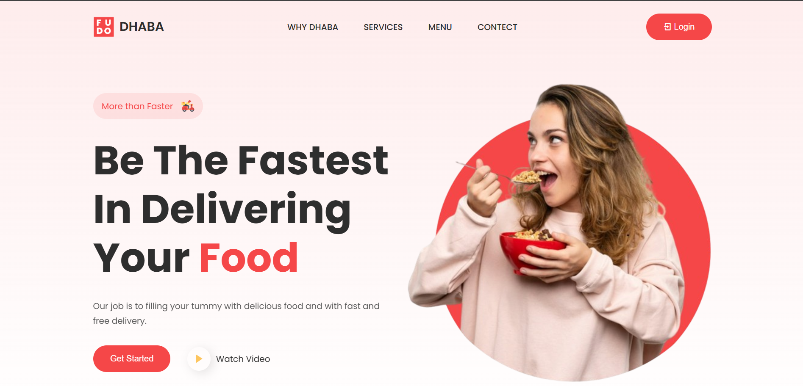

<h2 align="center">Dhaba Food Delivery Website</h2>

A fully responsive food delivery website, designed to cater to all devices. Built using **HTML**, **CSS**, and **JavaScript**.

---

## Demo Screenshot



---

## Features

- **Why Dhaba Section**: Highlights the unique selling points of Dhaba.
- **Services Section**: Lists the key services like fast delivery and catering.
- **Menu Section**: Displays an attractive menu of available dishes.
- **Contact Section**: A contact form for user inquiries and feedback.
- Fully responsive design that works seamlessly across all devices.

---

## How to Run Locally

1. Clone this repository:
   ```bash
   git clone https://github.com/your-username/dhaba-website.git

---

<section id="contact-me">
  <h2>📞 Contact Me</h2>
  <p>Have questions or feedback? Feel free to reach out:</p>
  <ul>
    <li><a href="https://github.com/TIRTH0409" target="_blank">GitHub</a></li>
    <li><a href="https://linkedin.com/in/tirth0409" target="_blank">LinkedIn</a></li>
    <li><a href="https://behance.net/TIRTH0409" target="_blank">Behance</a></li>
  </ul>
</section>
